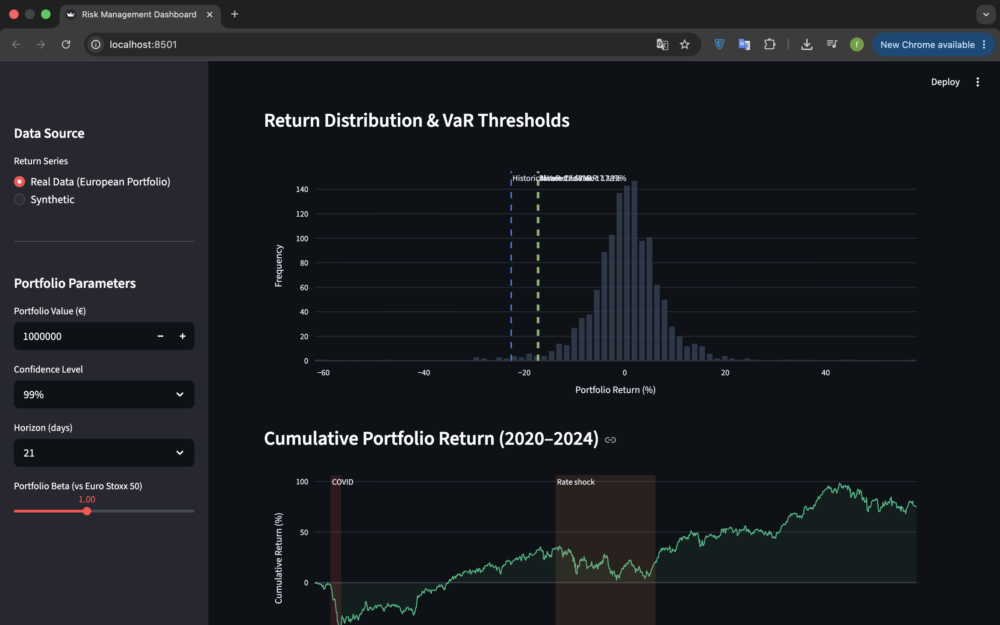

# VaR Risk Dashboard — European Equity Portfolio

Portfolio risk analytics suite implementing three Value at Risk methodologies and five historical crisis stress scenarios on a **real European large-cap equity portfolio** (BNP Paribas, TotalEnergies, ASML, Siemens, Airbus), with an interactive Streamlit dashboard.


---

## Portfolio

Equal-weight portfolio of five Euro Stoxx 50 constituents (2020–2024):

| Ticker | Name | Sector | Weight |
|--------|------|--------|--------|
| BNP.PA | BNP Paribas | Financials | 20% |
| TTE.PA | TotalEnergies | Energy | 20% |
| ASML.AS | ASML | Technology | 20% |
| SIE.DE | Siemens | Industrials | 20% |
| AIR.PA | Airbus | Industrials | 20% |

**Portfolio statistics (2020–2024):** Annual return 23.2% · Volatility 20.3% · Sharpe 1.14 · Max drawdown −22.4%

Data loaded live via `yfinance`; falls back to calibrated embedded parameters if offline.

---

## Results (€1M portfolio, 1-day horizon, real data)

### 95% Confidence Level

| Method | VaR (€) | VaR (%) | CVaR (€) |
|--------|---------|---------|---------|
| Historical Simulation | €20,691 | 2.07% | €25,690 |
| Parametric (Delta-Normal) | €20,069 | 2.01% | €25,401 |
| Monte Carlo (GBM) | €20,162 | 2.02% | €25,491 |

### 99% Confidence Level (Basel III standard)

| Method | VaR (€) | VaR (%) | CVaR (€) |
|--------|---------|---------|---------|
| Historical Simulation | €28,903 | 2.89% | €33,547 |
| Parametric (Delta-Normal) | €28,765 | 2.88% | €33,089 |
| Monte Carlo (GBM) | €28,871 | 2.89% | €33,142 |

Method convergence at 99% confidence confirms model stability. CVaR consistently exceeds VaR — capturing tail risk that VaR alone underestimates (Basel III requires CVaR reporting).

---

## Stress Testing — Historical Scenarios

| Scenario | Period | Market Shock | Portfolio Loss (β=1) |
|----------|--------|-------------|---------------|
| 2008 Financial Crisis | Sep 2008 – Mar 2009 | −56.5% | −€565,000 |
| COVID-19 Crash | Feb – Mar 2020 | −34.0% | −€340,000 |
| 2022 Rate Hike Shock | Jan – Oct 2022 | −25.5% | −€255,000 |
| Dot-Com Bust | Mar 2000 – Oct 2002 | −49.1% | −€491,000 |
| Black Monday 1987 | 19 Oct 1987 | −22.8% | −€228,000 |

Portfolio beta vs Euro Stoxx 50 is user-configurable in the dashboard sidebar.

---

## Dashboard



Three panels:
- **VaR Summary** — KPI cards for all three methods at selected confidence and horizon
- **Return Distribution** — empirical histogram with VaR threshold overlays
- **Cumulative Return** — annotated with COVID crash and 2022 rate shock periods
- **Stress Testing** — scenario losses with interactive beta scaling
- **Rolling VaR** — 1-year rolling window historical VaR over full period

Toggle between **Real Data** and **Synthetic** in the sidebar.

---

## Mathematical Foundation

### Value at Risk

For confidence level α and horizon h:

$$\text{VaR}_\alpha = -\inf\{x : P(L > x) \leq 1 - \alpha\}$$

**Parametric (Delta-Normal):**

$$\text{VaR}_\alpha = -(\mu h + z_\alpha \sigma \sqrt{h}) \cdot V$$

where $z_\alpha = \Phi^{-1}(1-\alpha)$ and $V$ is portfolio value.

**CVaR (Expected Shortfall):**

$$\text{CVaR}_\alpha = -\left(\mu h - \sigma\sqrt{h} \cdot \frac{\phi(z_\alpha)}{1-\alpha}\right) \cdot V$$

### Monte Carlo — Variance Reduction

Uses antithetic variates: for each random draw $z$, also simulates $-z$. Halves estimator variance without additional simulation cost at 100,000 paths.

### Square-Root-of-Time Scaling

Multi-day VaR: $\text{VaR}_h = \text{VaR}_1 \times \sqrt{h}$, valid under i.i.d. return assumption.

---

## Project Structure

```
var-risk-dashboard/
├── var_engine.py       — VaREngine class (Historical, Parametric, Monte Carlo + CVaR)
├── stress_testing.py   — StressTester class with 5 historical scenarios
├── real_data.py        — Market data loader (yfinance + calibrated fallback)
├── dashboard.py        — Streamlit dashboard (real/synthetic toggle)
├── tests/
│   └── test_var.py     — 9 unit tests
├── requirements.txt
└── .github/workflows/ci.yml
```

---

## Quick Start

```bash
pip install -r requirements.txt
streamlit run dashboard.py
```

Dashboard runs at `http://localhost:8501`.

---

## Tests

```bash
pytest tests/ -v
```

9 tests: positive VaR outputs · CVaR ≥ VaR invariant · monotonicity in confidence and horizon · all stress scenarios · beta scaling.

---

## Stack

Python · NumPy · SciPy · pandas · yfinance · Streamlit · Plotly · pytest

## Key Concepts

| Concept | Implementation |
|---------|---------------|
| VaR | Three methods: Historical Simulation, Parametric, Monte Carlo |
| CVaR / Expected Shortfall | All methods; Basel III reporting standard |
| Real market data | yfinance (live) with calibrated fallback |
| Antithetic variates | Monte Carlo variance reduction |
| Fat tails | Student-t mixture in synthetic mode |
| Stress testing | Five historical crisis scenarios, beta-scaled |
| Square-root-of-time | Multi-day horizon scaling |
